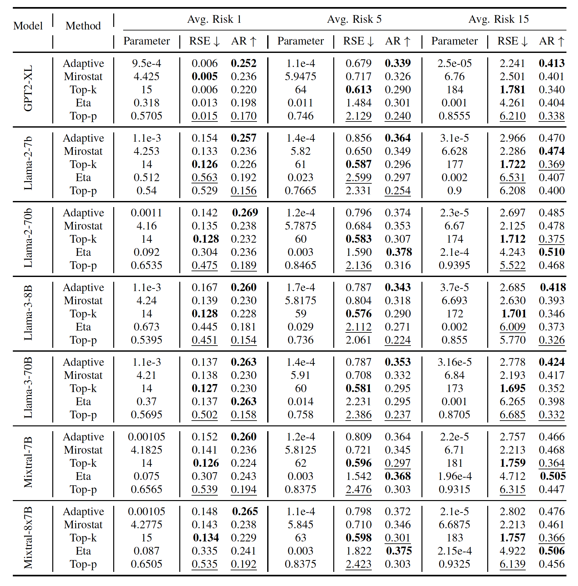

# An Evaluation Benchmark and User Guidline of Adaptive Sampling Decoding for LLMs in Open-Ended Text Generation

# Create the context-preserving prefix tree
Step 1: Build a context-preserving prefix tree from any existing dataset
```
python collect_prefix_tree.py
```
Step 2: Sort the context-preserving tree w.r.t. number of leaves of the current subtree
```
python sort_and_visualize_prefix_tree.py
```

Main features:
  - **Efficient Multi-Processing**: For example, given 2 sockets (24 cores per socket) of AMD EPYC 7402 processor, the script can process roughly 140k articles in 1 hour to build a context-preserving tree with sentence-level context. Then the total 6,458,670 articles of English Wikipedia dataset will be transformed into a context-preserving tree in around 2 days.
  - **Filtering**: For example, to avoid invalid words or rare proper names, we exclude the sentences containing such words by checking their presence in the WORD LIST dataset, which is available on the [word-list dataset homepage](https://web.archive.org/web/20131118073324/https://www.infochimps.com/datasets/word-list-350000-simple-english-words-excel-readable). It contains a total amount of 354986 words and explicitly excludes proper names and compound words. Section titles are also excluded, because they are often incomplete sentences with poor contextual information.
  - **Hashing-based Retrieval**: The extracted prefix tree is implemented as a nested dictionary and saved in a single JSON file. Since each lookup at any depth has constant complexity, the retrieval from our dataset is highly efficient. Moreover, the dictionary is easily extendable if extra data are needed for a more accurate estimation of the full data support.

Illustration of a context-preserving prefix tree:
<p align="center">
   
</p>
<p align="center">
   <b>Figure 1:</b> A fragment of the EnWiki CP-Trie. For brevity, only two child nodes are shown at each depth. The number at the left side of the slash symbol refers to the branching factor at the current node, and the number at the right side refers to the total number of leaves of the sub-tree with the current node as the root node.
</p>

# Evaluate truncation sampling methods
Step 1: Estimate the Optimal Truncations 
```
python estimate_optimal_truncation.py
```
Step 2: Compute the truncations of different methods
```
python compute_truncation.py
```
Step 3: Evaluate recall and stability at certain risk levels
```
python evaluate_recall_and_stability.py
```

Main features:
  - **Estimation of the Optimal Truncations**: Step 1 computes the estimation of the optimal truncation positions given different prefixes. Briefly speaking, truncation sampling is mainly based on the fact that most of the out-of-distribution tokens reside in the tail of the predicted distribution by LLMs. Therefore, the quality of the generated text is expected to be improved by excluding a proper fraction of tail from the sampling procedure. For more details such as the rationale of our estimation method, please refer to our paper. 

  - **Fair Comparison**: Step 2 computes the truncation positions of different methods given different prefixes at the same average risk level. A fair evaluation is guaranteed by comparing at the same average risk level, because the evaluation results are no longer affected by hyperparameter tuning. Step 3 mainly computes the two metrics of this benchmark, i.e., recall mean and risk standard error at a given average risk level, respectively.
    
  - **User Reference for Parameter Selection**: Step 3 additionally provides the corresponding parameters of the evaluated sampling methods at certain risk levels. Since an appropriate parameter is critical for the effectiveness of a sampling method, our evaluation results could serve as a guideline to save the efforts from the labrious trial-and-error parameter tuning in practice.  


# Integrate advanced sampling into Hugging Face

Using transformers 4.6.0.dev0 as an example, please copy the provided files under the huggingface directory to the path:
    
```
anaconda3/envs/your_environment_name/lib/python3.8/site-packages/transformers/
``` 
    
The implemented methods are as follows:
    
  - [Eta-Sampling](https://aclanthology.org/2022.findings-emnlp.249/): Set the parameter epsilon by parsing "eta" as an argument to the model.generate function.  
    
  - [Adaptive-Sampling](https://icml.cc/virtual/2024/poster/33683): Set the parameter epsilon by parsing "ada" as an argument to the model.generate function. 
    
  - [Mirostat](https://openreview.net/forum?id=W1G1JZEIy5_): Set the parameter tau by parsing "mirostat" as an argument to the model.generate function. 

Remark: the current implementation of Adaptive Sampling and Eta-Sampling doesn't support batch computation.

# Leaderboard
<p align="center">
   
</p>
<p align="center">
   <b>Figure 1:</b> Risk standard error (indicating stability) and recall mean (indicating diversity) of different truncation sampling methods at different risk levels using different models. The corresponding parameter of each method at a given risk level is also provided. The best and worst scores are marked in bold and blue, respectively. For more detailed results, please refer to appendix A.1 in the paper.
</p> 

Metrics: 
  - **Recall** Mean indicates the diversity of a sampling method.
  - **Risk Standard Error** indicates the adaptability of a sampling method. Notably, a lower risk standard error at a given risk level will lead to less amount of total risk in the auto-regressive generation process. For more details, please refer to our paper.


